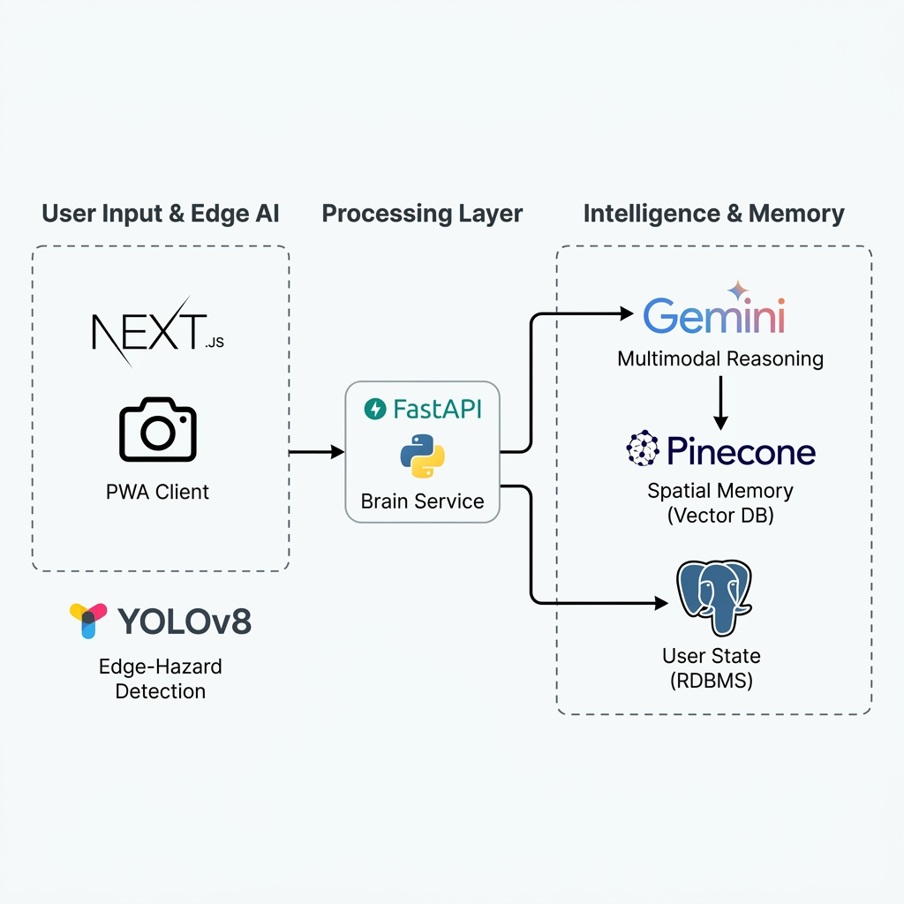

# See With Me - Advanced AI Mobility Assistant

"See With Me" is a high-performance, voice-native Progressive Web App (PWA) designed to provide real-time, contextual mobility and cognitive assistance for the visually impaired. By integrating Edge-AI safety filters with large-scale Multimodal reasoning, the system offers zero-latency protection and deep environmental understanding through a unified auditory interface.



## Technical Architecture & Design Decisions

The platform is built on a modern, decoupled stack selected for maximum performance, lower TTI (Time to Interactive), and high-fidelity intelligence.

### 1. Frontend: Next.js 16 & React
*   **Decision**: We utilized Next.js with the App Router and Server Components.
*   **Reasoning**: For an accessibility-first application, performance is critical. Server-side rendering reduces the client-side JavaScript execution load, ensuring that voice feedback flows remain uninterrupted by heavy UI re-renders. The PWA capabilities allow for offline fallback and native-like camera access.

### 2. Backend: FastAPI (Python 3.10+)
*   **Decision**: FastAPI was selected for the core logic layer.
*   **Reasoning**: Its native support for asynchronous programming (`async/await`) is essential when coordinating multiple AI model outputs and database queries simultaneously. FastAPI's Pydantic-based data validation ensures robust error handling, preventing crashes during safety-critical vision processing.

### 3. Intelligence: Google Gemini 1.5 Pro
*   **Decision**: Gemini 1.5 Pro serves as the primary Multimodal LLM.
*   **Reasoning**: Unlike traditional text-based models, Gemini 1.5 Pro natively understands interleaved data (text, image, audio). This allows a user to point their camera and ask, "Is that bus approaching?" while the model interprets the visual scene and the vocal inflection in a single context window.

### 4. Safety Layer: YOLOv8-nano (Edge AI)
*   **Decision**: We implemented YOLOv8-nano optimized for WASM/TensorFlow.js.
*   **Reasoning**: Relying on the cloud for safety is unacceptable in mobility contexts due to network latency. By running a nano-scale computer vision model directly on the user's device, we achieve <50ms hazard detection (walls, vehicles, obstacles), allowing the system to shout "STOP" even if the internet connection is lost.

### 5. Semantic Memory: Pinecone Vector Database
*   **Decision**: Pinecone manages the "Spatial Memory" feature.
*   **Reasoning**: Users can index the location of physical items (keys, wallets) simply by saying "I'm putting my keys on the counter." Pinecone's vector search allows for semantic retrieval, meaning the user can later ask "Where's my keychain?" and the system will locate the most relevant spatial record based on high-dimensional similarity.

### 6. Relational Persistence: PostgreSQL
*   **Decision**: PostgreSQL handles user sessions, settings, and historical logs.
*   **Reasoning**: It provides ACID compliance for sensitive user data and integrates seamlessly with SQLAlchemy for flexible state management during rapid scaling.

## System Implementation

The application features a fully decoupled architecture with a high-performance Next.js frontend and a scalable FastAPI backend.

### Prerequisites
- Node.js 18+
- Python 3.10+
- PostgreSQL
- Pinecone Account (for Spatial Memory)

### Installation & Setup

1. **Backend Configuration**:
   ```bash
   cd backend
   pip install -r requirements.txt
   cp ../.env.example .env
   # Update .env with your credentials
   uvicorn main:app --reload
   ```

2. **Frontend Configuration**:
   ```bash
   cd frontend
   npm install
   npm run dev
   ```

## Feature Roadmap
- [x] Voice-Native Interface & Earcon Support
- [x] Edge-AI Safety Throttling
- [x] Multimodal VQA Integration
- [x] Vectorized Spatial Memory
- [ ] Multi-User Profile Syncing
- [ ] Fallback Offline Navigation
