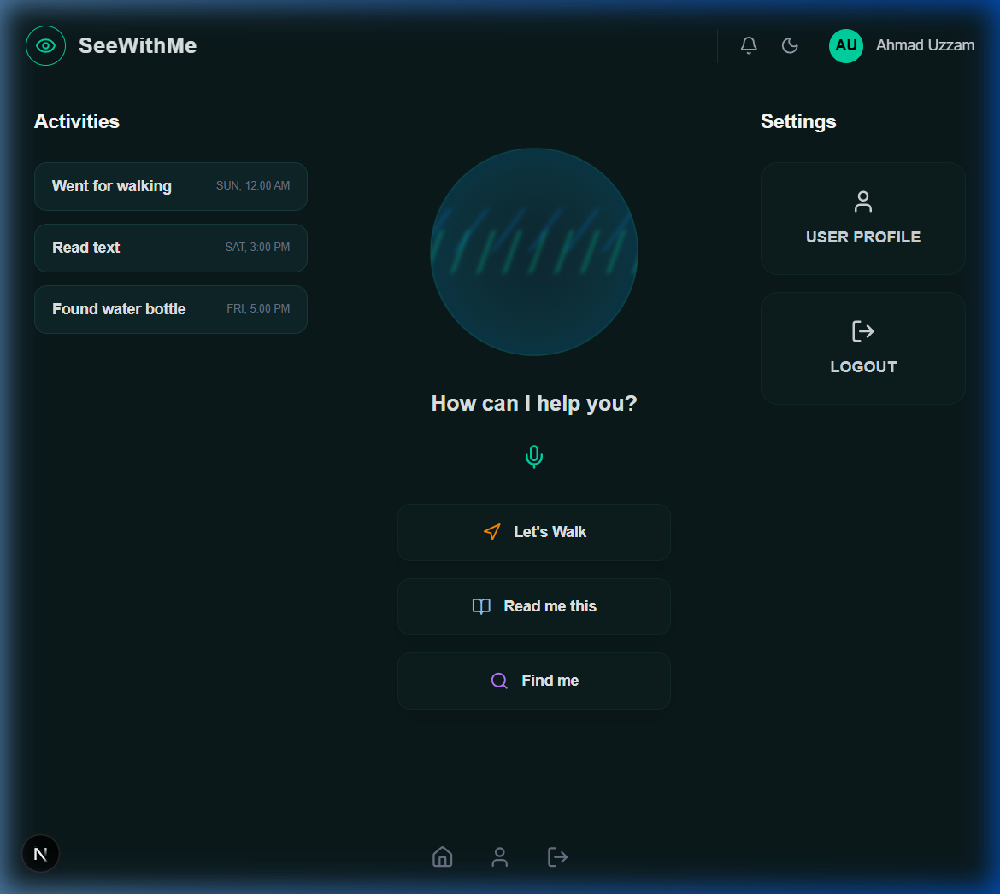
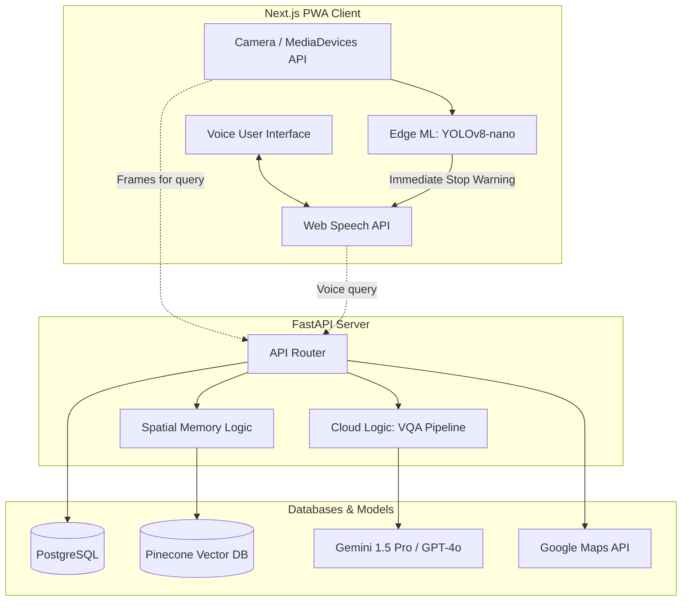

# See With Me - Progressive Voice Assistant

"See With Me" is a voice-native Progressive Web App (PWA) MVP designed to act as a real-time, contextual mobility and cognitive assistant for the visually impaired. Bypassing traditional touch interfaces, the application relies entirely on audio feedback and device camera inputs.

 <!-- Placeholder for screenshot -->

## Core Features
- **Voice-Native Micro-Navigation**: Turn-by-turn auditory guidance integrated with step-by-step instructions.
- **Zero-Latency Obstacle Detection**: Edge AI running directly on smartphone hardware to identify physical hazards instantly.
- **Contextual Visual Question Answering (VQA)**: Multimodal reasoning to answer questions about the environment.
- **Semantic Spatial Memory**: A high-value item locator using a continuously updating vector database.

## Technology Stack
- **Frontend**: Next.js, React, Tailwind CSS, Web Speech API.
- **Backend**: FastAPI
- **Edge AI**: TensorFlow.js, YOLOv8-nano (simulated)
- **Cloud AI**: Gemini 1.5 Pro / GPT-4o
- **Database**: Pinecone (Vector DB), PostgreSQL (RDBMS)
- **Deployment**: Vercel & Render/Railway

## Architecture Diagram

## Running the Demo

For this specific iteration, the **Frontend UI** is completely functional for demonstration purposes. The backend services represent the architecture layout but are not actively wired to running DB/LLM instances in the demo.

### Prerequisites
- Node.js 18+

### Steps
1. Navigate to the frontend directory: `cd frontend`
2. Install dependencies: `npm install`
3. Run the development server: `npm run dev`
4. Open [http://localhost:3000](http://localhost:3000) in your browser.
