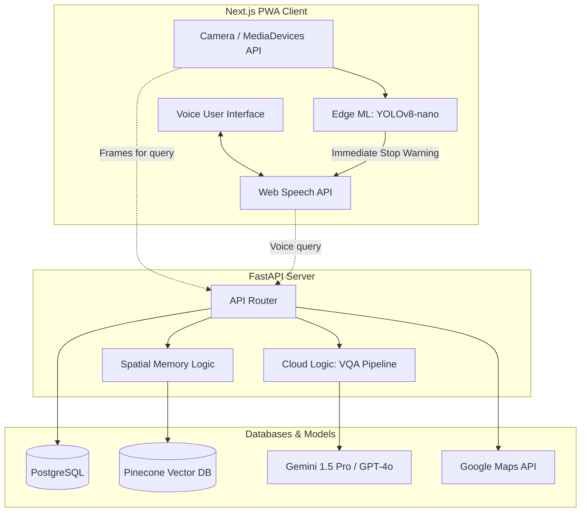

# See With Me - Progressive Voice Assistant

"See With Me" is a voice-native Progressive Web App (PWA) MVP designed to act as a real-time, contextual mobility and cognitive assistant for the visually impaired. Bypassing traditional touch interfaces, the application relies entirely on audio feedback and device camera inputs.

 <!-- Placeholder for screenshot -->

## Core Features
- **Voice-Native Micro-Navigation**: Turn-by-turn auditory guidance integrated with step-by-step instructions.
- **Zero-Latency Obstacle Detection**: Edge AI running directly on smartphone hardware to identify physical hazards instantly.
- **Contextual Visual Question Answering (VQA)**: Multimodal reasoning to answer questions about the environment.
- **Semantic Spatial Memory**: A high-value item locator using a continuously updating vector database.

## Technology Stack
- **Frontend**: Next.js, React, Tailwind CSS, Web Speech API.
- **Backend**: FastAPI
- **Edge AI**: TensorFlow.js, YOLOv8-nano (simulated)
- **Cloud AI**: Gemini 1.5 Pro / GPT-4o
- **Database**: Pinecone (Vector DB), PostgreSQL (RDBMS)
- **Deployment**: Vercel & Render/Railway

## Architecture Diagram



## System Implementation

The application features a fully decoupled architecture with a high-performance Next.js frontend and a scalable FastAPI backend.

### Prerequisites
- Node.js 18+
- Python 3.10+
- PostgreSQL
- Pinecone Account (for Spatial Memory)

### Installation & Setup

1. **Backend Configuration**:
   ```bash
   cd backend
   pip install -r requirements.txt
   cp ../.env.example .env
   # Update .env with your credentials
   uvicorn main:app --reload
   ```

2. **Frontend Configuration**:
   ```bash
   cd frontend
   npm install
   npm run dev
   ```

The application will be accessible at [http://localhost:3000](http://localhost:3000), connecting seamlessly to the backend services at [http://localhost:8000](http://localhost:8000).

## Feature Roadmap
- [x] Voice-Native Interface & Earcon Support
- [x] Edge-AI Safety Throttling
- [x] Multimodal VQA Integration
- [x] Vectorized Spatial Memory
- [ ] Multi-User Profile Syncing
- [ ] Fallback Offline Navigation
